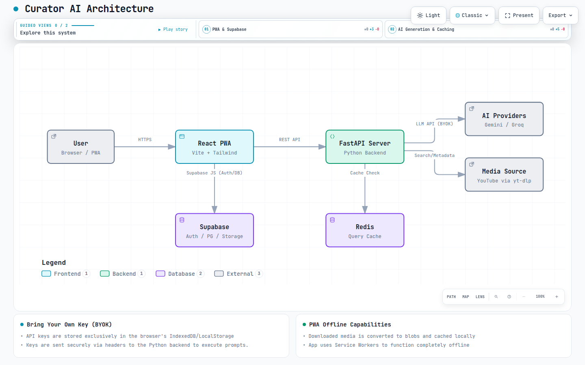

<div align="center">
  
  <h1>Curator AI 🎵📚</h1>
  <p><strong>Transform any topic, artist, or vibe into a structured learning path or a curated music mix in seconds.</strong></p>

  [](https://opensource.org/licenses/MIT)
  [](https://reactjs.org/)
  [](https://fastapi.tiangolo.com/)
  [](https://www.docker.com/)
</div>

<br />

Curator AI is a **hybrid cloud PWA (Progressive Web App)** that sits at the intersection of AI curation, cloud-synced media, and offline playback. It utilizes a React frontend with IndexedDB offline capabilities, powered by a robust Python FastAPI backend and Supabase for cloud sync.

## 🌐 Live Application
Try the live web app directly: **[https://curator.foodzie.store](http://curator.foodzie.store)**

> **Note:** Curator AI is a fully installable PWA. Click "Install App" in your browser's address bar or share menu to install it natively on your Android, iOS, Windows, or Mac device. It works entirely offline!

## ✨ Features
- **Progressive Web App (PWA):** Installs natively on any device. Downloaded music is saved safely in your browser's IndexedDB for complete offline playback.
- **BYOK Architecture:** (Bring Your Own Key) Uses your personal Gemini or Groq keys for completely free, unlimited AI generations. Keys are securely synced across all your devices using Supabase.
- **Personal Cloud Library:** Smart batch-sync your media between devices, or upload massive collections via the provided `scripts/upload_music_to_cloud.py`.
- **Intelligent Querying:** Intercepts searches to prioritize your Cloud Library tracks instantly before falling back to the Gemini/Groq APIs.
- **Global Redis Caching:** AI roadmap generation and YouTube queries are cached globally using Redis, resulting in instant 0-latency responses for duplicate searches.
- **Dockerized Deployments:** A single `docker-compose.yml` instantly spins up the frontend Nginx server and the Python API backend.

## 🏗️ Architecture

<picture>
  <source media="(prefers-color-scheme: dark)" srcset="docs/architecture/curator-ai-architecture.visual-check.1440x900.dark.png">
  <source media="(prefers-color-scheme: light)" srcset="docs/architecture/curator-ai-architecture.visual-check.1440x900.light.png">
  
</picture>

*(For an interactive, animated version of this map, **[click here to view the live preview](https://htmlpreview.github.io/?https://github.com/Jaspreet-Bhatia-SI/CuratorAI/blob/main/docs/architecture/curator-ai-architecture.html)**).*

- **Frontend UI:** React + Vite + TailwindCSS (Material 3 Design)
- **Backend API:** Python FastAPI + `yt-dlp` for media resolution
- **PWA Integration:** `vite-plugin-pwa` with localforage (IndexedDB)
- **Database & Auth:** Supabase (PostgreSQL)
- **Caching Layer:** Redis

## 🛠️ Developer Setup

If you want to edit the code and run the app locally:

```bash
# 1. Clone the repository
git clone https://github.com/Jaspreet-Bhatia-SI/CuratorAI.git
cd CuratorAI

# 2. Configure Environment Variables
cp backend/.env.example backend/.env
cp frontend/.env.example frontend/.env
# Edit both .env files with your Supabase credentials!

# 3. Setup Frontend
cd frontend
npm install
npm run dev

# 4. Setup Backend (in a new terminal)
cd backend
python -m venv venv
source venv/bin/activate
pip install -r requirements.txt
uvicorn main:app --reload --port 8000
```

## 🚀 Production Deployment (Docker)

Deploying to a VPS is incredibly simple using Docker.

```bash
git clone https://github.com/Jaspreet-Bhatia-SI/CuratorAI.git
cd CuratorAI

# Configure backend environment variables
nano backend/.env

# Spin up both the Nginx Frontend and the FastAPI Backend
docker-compose up -d --build
```
*The app will automatically be served on port `8085` as configured in the `docker-compose.yml`.*

## 🤝 Contributing
Contributions, issues, and feature requests are welcome! Feel free to check the [issues page](../../issues).

## 📝 License
This project is [MIT](LICENSE) licensed. Copyright © 2026 Jaspreet-Bhatia-SI (JBSI).
